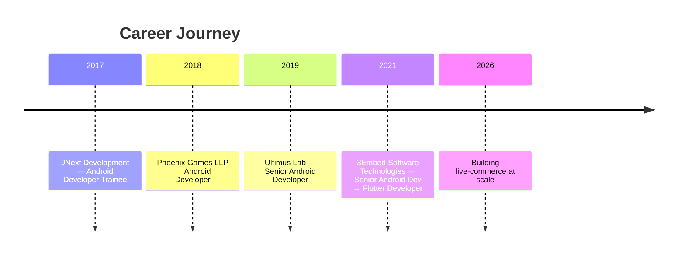

<h1 align="center">
  
</h1>

<p align="center">
  <a href="https://mayur.dev"></a>
  <a href="https://linkedin.com/in/mayurdabhi"></a>
  <a href="mailto:mayurdabhi041@gmail.com"></a>
  <a href="https://play.google.com/store/apps/developer?id=Mayur+Dabhi"></a>
</p>

<p align="center">
  
  
</p>

---

###  About Me


```dart
const mayur = Developer(
  role: 'Senior Mobile Engineer',
  experience: '8+ years',
  location: 'India 🇮🇳',
  languages: ['Dart', 'Kotlin', 'Java'],
  specialties: [
    'Live Streaming (LiveKit / WebRTC)',
    'MQTT Real-Time Messaging',
    'Audio / Video Calling',
    'Cross-Platform Architecture',
  ],
  currentlyBuilding: 'Live-commerce at scale',
  funFact: 'One codebase → Android, iOS & Web 🚀',
);
```

- 📱 **8+ years** designing, building & shipping production mobile apps
- 🎥 Built complete **live streaming modules** with **LiveKit (WebRTC)** & **MQTT**
- 🦋 **Flutter** developer shipping to **Android, iOS & Web** from a single codebase
- 🤖 Deep **native Android** expertise — Kotlin, Jetpack Compose, MVVM, Coroutines
- 👨‍🏫 Mentor junior devs, lead code reviews & drive performance optimization
- 🌐 Portfolio → **[mayur.dev](https://mayur.dev)**
- 💬 Ask me about **live streaming, WebRTC, MQTT, Flutter & Android architecture**

<br clear="right"/>

---

### 🛠️ Tech Stack

**Languages**

<p>
  
  
  
  
</p>

**Mobile & Cross-Platform**

<p>
  
  
  
  
</p>

**Real-Time & Media**

<p>
  
  
  
  
</p>

**Backend, Cloud & APIs**

<p>
  
  
  
  
  
  
</p>

**Payments, Maps & Tools**

<p>
  
  
  
  
  
  
</p>

---

### 🚀 Featured Projects

<table>
<tr>
<td width="50%" valign="top">

#### 🛍️ TFM — Truly Free Home
`Flutter` · `Android · iOS · Web`

Live-commerce platform where users shop through **interactive live streams**. **5,000+ downloads**, live shopping streams daily.

- Owned the **entire live streaming module** with LiveKit (WebRTC)
- MQTT-driven live chat, viewer counts, reactions & product drops
- In-stream purchasing without leaving the broadcast
- One Flutter codebase → 3 platforms


</td>
<td width="50%" valign="top">

#### 📸 Dubly
`Android` · `Java · Kotlin` · **Live on Google Play**

Social platform for photos & short videos with **go-live**, real-time chat, audio/video calls, reactions and wallet tipping.

- Live streaming + A/V calling via LiveKit & MQTT
- Digital wallet with Google In-App Billing
- FFmpeg-powered media processing pipeline


</td>
</tr>
<tr>
<td width="50%" valign="top">

#### 🚚 HAMMER
`Android` · `Java` · Logistics

Heavy-goods transport management — job creation, driver acceptance flow, **live truck tracking** and proof-of-delivery.

- Real-time location tracking with Google Maps + MQTT
- Job workflows over **GraphQL** and REST


</td>
<td width="50%" valign="top">

#### 🧘 Ayurveda Life &nbsp;·&nbsp; 😄 Smile Capture
`Android` · `Java` · Wellness & ML

**Ayurveda Life** — hydration/meal/sleep reminders with animated water-intake tracking & custom alarms.

**Smile Capture** — real-time facial expression detection that auto-captures selfies on a smile, multi-face support.


</td>
</tr>
</table>

---

### 💼 Experience



| Company | Role | Period |
|---|---|---|
| **3Embed Software Technologies** | Senior Android Developer → Flutter Developer | 09/2021 – Present |
| **Ultimus Lab** | Senior Android Developer | 10/2019 – 09/2021 |
| **Phoenix Games LLP** | Android Developer | 06/2018 – 10/2019 |
| **JNext Development** | Android Developer Trainee | 09/2017 – 03/2018 |

🎓 **B.E. Information Technology** — Government Engineering College, Bhavnagar (2014–2018)

---

### 📊 GitHub Stats

<p align="center">
  
  
</p>

<p align="center">
  
</p>

<p align="center">
  
</p>

<p align="center">
  
</p>

---

### 🐍 Contribution Snake

<p align="center">
  
</p>

---

### 💡 Dev Quote

<p align="center">
  
</p>

---

<h3 align="center">🤝 Let's Connect</h3>

<p align="center">
  <a href="https://mayur.dev"></a>
  <a href="https://www.linkedin.com/in/myt041"></a>
  <a href="mailto:mayurdabhi041@gmail.com"></a>
  <a href="https://play.google.com/store/apps/dev?id=7022237024880570606"></a>
</p>

<p align="center">
  <i>⭐ From <a href="https://github.com/myt041">myt041</a> — open to interesting mobile & real-time projects.</i>
</p>


